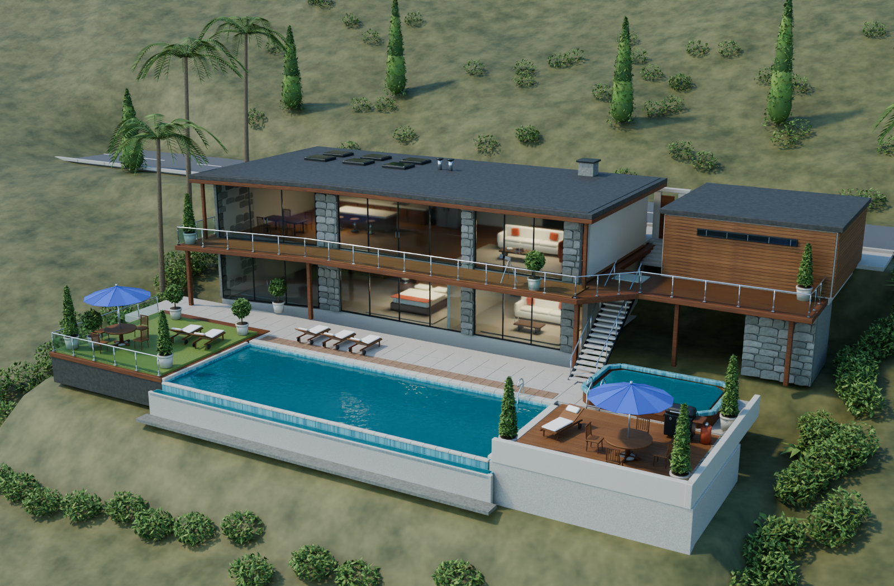
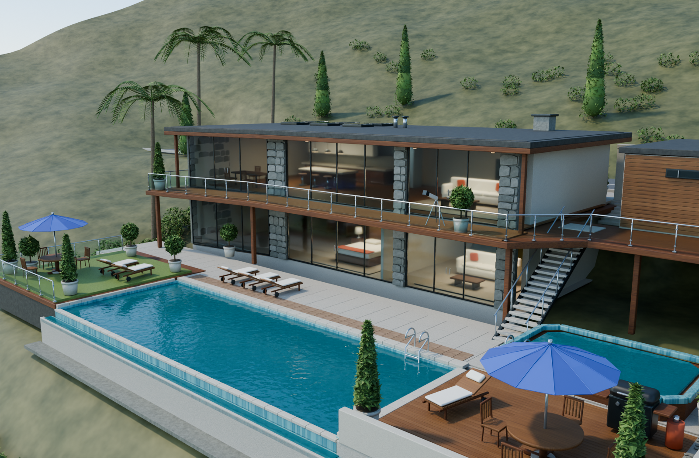
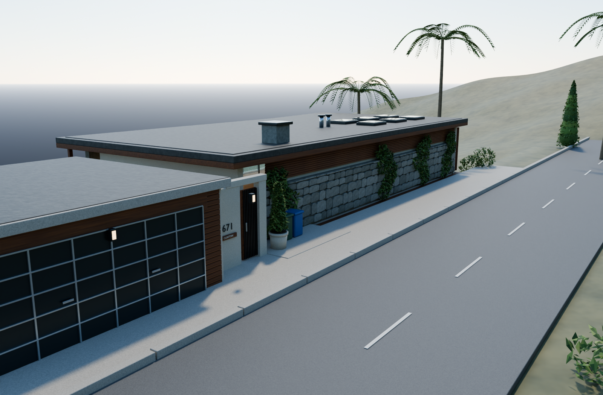

# Franklin 的山坡别墅 · Blender 工程

参照 GTA V 中 Franklin 后期居住的 **3671 Whispymound Drive** 制作的 Blender 参考重建。重点重建建筑外观和泳池庭院，并加入窗内可见的简化室内陈设。比例根据截图估算，不是游戏原始模型或精确测绘。

主文件：**[Franklin_3671_Whispymound.blend](Franklin_3671_Whispymound.blend)**



## 打开与查看

使用 Blender 5.1 或更新版本打开主文件。工程采用米制，泳池露台标高为 0 m，临街入口及上层地板约为 3.7 m。材质全部程序化，无需下载贴图或安装插件。

- 数字小键盘 **0**：切换相机视图。
- 时间轴第 **1 / 2 / 3 / 4** 帧：分别切换整体、泳池露台、临街入口和俯视相机。
- Outliner 中按建筑、窗户栏杆、泳池、庭院家具、室内、植物等分成 11 个集合。
- 隐藏 `03 · Stone, timber & roof` 集合内的屋顶对象，可查看室内。

重新运行建模脚本会覆盖主工程文件。手工修改后请另存副本。

## 效果图

| 泳池露台 | 临街入口 |
| --- | --- |
|  |  |

已包含：错层主体、折线形玻璃阳台、屋顶挑檐、天然石饰面、木饰面、天窗、侧楼梯、双车位车库、3671 门牌、无边泳池、按摩池、池边木平台、蓝色遮阳伞、躺椅、烧烤架、栏杆、棕榈及绿化。室内包括客厅、厨房、餐桌、卧室及衣柜的简化陈设。

## 重建与渲染

在仓库根目录运行（把 `Blender` 换成本机可执行文件路径）：

```sh
# 从脚本重建主工程（会覆盖 Franklin_3671_Whispymound.blend）
Blender --background --factory-startup --python scripts/build_franklin.py

# 渲染相机 1–3 的静帧到 renders/
Blender --background Franklin_3671_Whispymound.blend --python scripts/render_views.py -- 1 2 3
```

macOS 示例：

```sh
/Applications/Blender.app/Contents/MacOS/Blender --background --factory-startup --python scripts/build_franklin.py
/Applications/Blender.app/Contents/MacOS/Blender --background Franklin_3671_Whispymound.blend --python scripts/render_views.py -- 1 2 3
```

默认使用 Cycles；Apple Silicon 优先 Metal GPU。脚本中可改建筑尺寸、植物、材质和渲染参数。`render_views.py` 还可传 `--draft` 做低采样预览。

## 漫游视频

成品在 [`video/Franklin_Villa_Walkthrough.mp4`](video/Franklin_Villa_Walkthrough.mp4)：约 14 秒、1280×720、24 fps、H.264。三个真实三维镜头依次展示别墅全貌、泳池立面、临街入口，镜头之间有淡化转场。

独立动画工程是 **[Franklin_Walkthrough.blend](Franklin_Walkthrough.blend)**（时间轴 1–360 帧），不覆盖静帧工程。

```sh
# 从静帧工程生成漫游工程
Blender --background Franklin_3671_Whispymound.blend --python scripts/create_walkthrough.py

# 渲染帧序列（支持跳过已完成帧后续渲染）
Blender --background Franklin_Walkthrough.blend --python scripts/render_walkthrough.py

# 编码 MP4，并检查尺寸、时长及解码
python3 scripts/encode_walkthrough.py
```

帧序列写在 `video/frames/`，体积较大，不纳入 git；需要时按上面步骤重新渲染。

## 目录

| 路径 | 内容 |
| --- | --- |
| `Franklin_3671_Whispymound.blend` | 主工程（静帧、四台相机） |
| `Franklin_Walkthrough.blend` | 漫游动画工程 |
| `scripts/build_franklin.py` | 程序化建模 |
| `scripts/render_views.py` | 静帧渲染 |
| `scripts/create_walkthrough.py` | 生成漫游工程 |
| `scripts/render_walkthrough.py` | 渲染漫游帧序列 |
| `scripts/encode_walkthrough.py` | 编码并校验 MP4 |
| `renders/` | 预览与正式效果图 |
| `video/` | 漫游 MP4 |
| `references/` | 游戏截图对照，不参与材质或渲染 |
| `scene_manifest.json` | 对象 / 网格 / 材质统计 |
| `LICENSE` | CC BY 4.0 许可全文 |

## 许可

本仓库中由作者创作的内容（Blender 工程、脚本、效果图、漫游视频等）采用 [CC BY 4.0](https://creativecommons.org/licenses/by/4.0/) 许可，全文见 [`LICENSE`](LICENSE)。使用、改编或再分发时请署名，并附上许可链接。

推荐署名：`chius-me / franklin-house`（https://github.com/chius-me/franklin-house），CC BY 4.0。

`references/` 中的游戏截图仅作建模对照，版权归原作者及 Take-Two Interactive / Rockstar Games 所有，**不在**本许可范围内。

Grand Theft Auto、GTA V、Franklin、3671 Whispymound Drive 及相关名称是 Take-Two Interactive / Rockstar Games 的商标或版权作品。本项目为非官方粉丝向参考重建，与上述公司无关，也不构成对其知识产权的授权。

## 参考

- [GTA Base · 3671 Whispymound Drive](https://www.gtabase.com/grand-theft-auto-v/properties/story-mode/3671-whispymound-drive-franklin-house)
- [Sportskeeda · 临街车库与入口](https://www.sportskeeda.com/gta/why-lester-give-franklin-house-gta-5)
